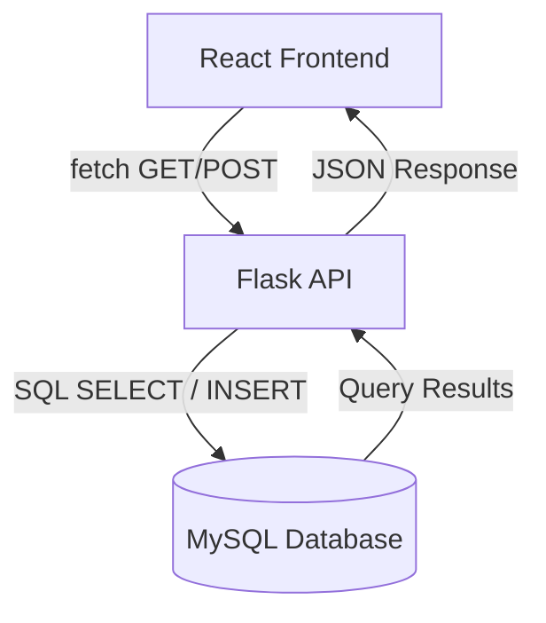

# Student Management — Day 44

## Project Overview

This project extends the existing Student Management application from the previous internship days. The temporary Python student data has been replaced with persistent MySQL storage.

The complete architecture is:



## Technology Stack

- React + Vite
- Flask
- Python
- MySQL
- mysql-connector-python
- Flask-CORS
- python-dotenv
- HTML/CSS/JavaScript

## MySQL Database Setup

Open MySQL Workbench and run:

```sql
SOURCE database/student_management.sql;
```

Or open `database/student_management.sql`, execute it, and verify:

```sql
USE student_management;
SELECT * FROM students;
```

The script creates the database, creates the `students` table, and inserts five sample records.

## Database Structure

| Field | Type | Constraint |
|---|---|---|
| id | INT | Primary Key, Auto Increment |
| name | VARCHAR(100) | NOT NULL |
| email | VARCHAR(150) | NOT NULL, UNIQUE |
| course | VARCHAR(100) | NOT NULL |

## API Endpoints

### GET /api/students

Retrieves all student records from MySQL.

Example response:

```json
{
  "success": true,
  "students": [
    {
      "id": 1,
      "name": "Arun Kumar",
      "email": "arun@example.com",
      "course": "AI & Data Science"
    }
  ]
}
```

### POST /api/students

Adds a new student to MySQL.

Request:

```json
{
  "name": "New Student",
  "email": "new@example.com",
  "course": "Computer Science"
}
```

The API validates required fields, inserts the record, and returns the created student.

## Frontend → Backend → MySQL Architecture

### GET Flow

React `fetch()` → `GET /api/students` → Flask → MySQL `SELECT` → Flask JSON → React state → Student List

### POST Flow

React Form → `fetch()` → `POST /api/students` → Flask validation → MySQL `INSERT` → JSON response → React success message → refreshed Student List

## How to Run the Project

### 1. Start MySQL

Make sure the MySQL Server is running.

### 2. Configure Flask

Copy:

```text
backend/.env.example
```

to:

```text
backend/.env
```

Then enter your local MySQL credentials.

Example:

```env
DB_HOST=localhost
DB_USER=root
DB_PASSWORD=your_password
DB_NAME=student_management
```

Do not commit `.env`.

### 3. Start Flask

```bash
cd backend
python -m venv venv
```

Windows:

```bash
venv\Scripts\activate
```

Install dependencies:

```bash
pip install -r requirements.txt
```

Run:

```bash
python app.py
```

Flask runs on:

```text
http://127.0.0.1:5000
```

### 4. Start React

Open a second terminal:

```bash
cd frontend
npm install
npm run dev
```

Open the Vite URL shown in the terminal, normally:

```text
http://localhost:5173
```

## Environment Configuration

Database credentials are loaded from environment variables:

- `DB_HOST`
- `DB_USER`
- `DB_PASSWORD`
- `DB_NAME`

The real `.env` file is ignored by Git.

## Error Handling

The Flask API handles:

- Database connection failure
- Invalid SQL/database operation
- Missing required fields
- Duplicate email
- Insert failure

Responses are returned as JSON, for example:

```json
{
  "success": false,
  "message": "Unable to save student"
}
```

The React frontend displays the returned error message to the user.

## Data Persistence Verification

1. Add a student from the React form.
2. Confirm the success message.
3. Run `SELECT * FROM students;` in MySQL Workbench.
4. Confirm the new row exists.
5. Refresh the React application.
6. Confirm the student is loaded again from MySQL.

This demonstrates persistent database storage instead of temporary in-memory Python data.

## Day 44 Submission Checklist

- Existing Student Management project continued
- MySQL database created
- `students` table created
- Five sample records inserted
- Flask connected to MySQL
- GET `/api/students` reads from MySQL
- POST `/api/students` writes to MySQL
- React Student List works
- React Form works
- Loading state works
- Success message works
- Database errors handled
- Data verified directly in MySQL
- Data persists after refresh
- README updated
- Credentials protected with `.env`

## Day 45 — API Testing with Postman

* Automated checks passed for `GET /api/students` and `POST /api/students`
* Automated checks passed for invalid inputs, duplicate email, invalid endpoints, and unsupported HTTP methods
* Verified expected HTTP status codes (`200`, `201`, `400`, `404`, `405`, `409`)
* Verified MySQL connectivity and post-test record count; direct SQL row inspection remains manual
* Documented the existing React ↔ Flask ↔ MySQL flow; browser verification remains manual
* Created Postman collection: `postman/Student_Management_API.postman_collection.json`
* Created API testing documentation: `docs/day-45-api-testing.md`

